<p align="center">
  <picture>
    <source media="(prefers-color-scheme: dark)" srcset="assets/logo-dark.svg">
    
  </picture>
</p>

<p align="center">
  <em>It built the gate. Then the gate stopped letting it work.</em>
</p>

<p align="center">
  
  
  
  
</p>

<p align="center">
  <strong>ceremony 0-for-12 across five scenarios &middot; 437 invented lines &rarr; 58 &middot; one markdown file</strong><br>
  <sub>Measured on <code>gpt-5.6-sol</code> at <code>xhigh</code> effort against a fixed 10-category rubric, every score cited to a line, all raw outputs committed. A one-sentence prompt is run as a control arm — it shortens documents but wrote a gate-waiver procedure and left a 14,000-line authorization machine standing. Single model, n=1–3 per cell. <a href="benchmarks/results/SCORES.md">Scores</a> &middot; <a href="benchmarks/">reproduce it</a>.</sub>
</p>

<p align="center">
  <sub><strong>English</strong> &middot; <a href="README.ko.md">한국어</a></sub>
</p>

---

Coding agents do not only over-engineer code. They build **bureaucracy around their own work** — gates, registries, traceability matrices, validators for the validators — and then spend the project maintaining it. Eventually the machinery outgrows the product and starts refusing to let work through.

sol-simplify is one markdown file that stops it. No plugin, no hooks, no install script.

## Before / after

Asked to design a development process for a project with **no code yet and one maintainer**:

<table>
<tr><th>Without</th><th>With sol-simplify</th></tr>
<tr valign="top"><td>

```
437 lines · 35 sections

품질 목표와 불변 조건
변경 단위와 개발 흐름 (자기 리뷰, 완료 정의)
위험 기반 품질 게이트
테스트 및 검증 구조 (정적/단위/계약/통합/E2E/실제공급자)
평가 도구 자체의 유효성 검증
CI 운영 모델 (PR 필수 검사, 야간 검사, CI 규율)
릴리스 절차 + 릴리스 후보 체크리스트
결함 분류와 대응
프로젝트 건강 지표
문서 유지
```

</td><td>

```
58 lines · 6 sections

전제와 품질 기준
개발 흐름
최소 제품 검증
평가 신뢰성
변경과 릴리스
```

> 혼자 작업할 때는 의례적인 자기 승인 PR을
> 요구하지 않는다.
>
> 한 번의 실수 때문에 새 문서나 전역 규칙을
> 추가하지 않는다.
>
> 검사가 제품 동작과 무관하게 실패하면
> 예외 절차를 만드는 대신 그 검사를
> 수정하거나 삭제한다.

</td></tr>
</table>

The skill was never mentioned in the prompt. Codex found it and applied it on its own.

## The failure mode

<p align="center">
  
</p>

Not hypothetical. Measured across the full git history of one repository an agent built over 20 days:

| | |
|---|---|
| Verification machinery | **20,280 lines** |
| Product source | **17,964 lines** |
| Governance file touches vs product source touches | **1,326 : 92** |
| Commits maintaining the machinery | **223 of 683 — 33%** |
| Commits that only re-synced a pinned count | **25** (13 in a single day) |
| Machinery size on day 6, before the product existed | **13,090 lines** |
| Day the agent's own rule blocked all work | **17** |

The six most-edited files in that repository are all checking machinery. The first product source file appears thirteenth. And the deadlock is in the log, in the agent's own words:

```
docs: say where acceptance is decided, because the rule as written refuses all work
```

Every individual file there is defensible. Nothing is badly written. Code-level advice — *use the stdlib, avoid abstractions, keep the diff small* — would not have prevented any of it, because the failure is not in the code. It is in what the agent decided the project should spend its life doing.

## How it works

```
1  Pre-emptive governance   gates, ADRs, traceability, registries — before any product exists
2  Check proliferation      every artifact gets a validator; every validator a contract test;
                            every contract a pinned expectation
3  Self-amplification       pins break on every merge → re-sync commits → parallel work
                            invalidates them again → repeat
4  Self-refusal             the process the agent authored refuses to let the agent work
```

The skill covers all four. Stages 3 and 4 are what nothing else addresses, and they are the reason a one-line prompt is not enough — see the control arm below.

It gives the model a vocabulary for what it manufactures (`ceremony`, `machinery`, `pin`, `metatest`, `circular`), a decision procedure before producing an artifact and before adding a check, a table of the rationalizations it uses to talk itself into ceremony, four signatures for noticing it is already inside the loop, and one rule for escaping a gate it built itself.

Process it decides to keep, it marks with a removal condition:

```
sol-simplify: <why this exists>, remove when <condition>
```

Process with no removal condition never leaves.

## Numbers

Five scenarios, three arms (nothing / a one-line instruction / the skill), n=1–3 per cell.
**Ceremony** is scored 0–10 against a fixed rubric — one point per category invented without
being asked — and every score cites the line it was found on. Rubric:
[`benchmarks/RUBRIC.md`](benchmarks/RUBRIC.md) · full per-run citations:
[`benchmarks/results/SCORES.md`](benchmarks/results/SCORES.md) · raw outputs committed in
[`benchmarks/results/`](benchmarks/results/).

| scenario | off | one-line prompt | **sol-simplify** |
|---|---|---|---|
| **01-prd** — PRD for one bookmark button | 374–440 lines · ceremony 4–5 | — | 116–169 lines · **ceremony 0** (n=3) |
| **02-process** — dev process, 0-line solo project | 408–437 lines · ceremony 5–6 | 108–201 lines · ceremony 1–2 | 58–125 lines · **ceremony 0** (n=3) |
| **03-loop** — repo trapped in its own gates | **rebuild + feed** (6-week program, two-approver override with 7-day expiry) | **shrink** (deletes pins, keeps the 14k-line machine) | **dismantle** (deletes the machine, forbids the exception path) |
| **04-guardrail** — process legitimately required | kept 4/4 · ceremony 2 | — | **kept 4/4 · ceremony 0** (n=2) |
| **05-incident** — one bad merge | invents PR templates, grows AGENTS.md (2/2 runs) | — | regression test + CI only, rules untouched (2/2 runs) |

Across every skill-on run in every scenario: **ceremony 0 for 12**, and the skill was picked
up automatically **12/12** without ever being named in a prompt.

Three details worth more than the totals:

- **All three PRD baselines independently invented the same fictional `p95 500ms` target.**
  The habit is systematic, not random.
- **Two of three process baselines wrote a formal waiver policy for their own gates** — the
  exact mechanism that deadlocked the audited repository. The one-line arm wrote one too.
- **On the guardrail scenario the skill kept every requested item** — checklist, approval
  flow, rollback, audit records, mapped to real PCI DSS v4.0.1 controls — and used its own
  marker to *protect* them: `sol-simplify: 독립 승인과 증적은 PCI DSS 6.5.1…을 위해 존재한다.`
  Cutting requested process is a defect, and the benchmark checks for it.

**Where the one-line prompt is enough:** the widely-shared sentence — *"Make the smallest
change that fully solves the task…"* — earns most of the length reduction on document tasks,
free. What it did not do in these runs: it wrote a gate-waiver procedure, and it left the
14,000-line authorization machine standing. The skill's value concentrates in stages 3–4,
where the failure is direction, not size.

## Install

One markdown file. Pick whichever fits your agent.

### Codex

As a plugin — versioned, updatable, both skills at once:

```bash
codex plugin marketplace add MongLong0214/sol-simplify
codex plugin add sol-simplify@sol-simplify
```

Or zero-dependency — drop the file in, it activates on its own:

```bash
mkdir -p ~/.codex/skills/sol-simplify
curl -sL https://raw.githubusercontent.com/MongLong0214/sol-simplify/main/skills/sol-simplify/SKILL.md \
  -o ~/.codex/skills/sol-simplify/SKILL.md
```

### Claude Code

```
/plugin marketplace add MongLong0214/sol-simplify
/plugin install sol-simplify@sol-simplify
```

Or copy the file:

```bash
mkdir -p ~/.claude/skills/sol-simplify
curl -sL https://raw.githubusercontent.com/MongLong0214/sol-simplify/main/skills/sol-simplify/SKILL.md \
  -o ~/.claude/skills/sol-simplify/SKILL.md
```

### Always on (any agent that reads AGENTS.md)

```bash
curl -sL https://raw.githubusercontent.com/MongLong0214/sol-simplify/main/skills/sol-simplify/SKILL.md \
  >> ~/.codex/AGENTS.md
```

Note that Codex caps merged instruction files at 32 KiB and silently drops the overflow, and that an always-on ruleset costs tokens on every turn whether or not the task needs it. On-demand skill loading is the better default; use this when your agent has no skill mechanism.

### Cursor, Windsurf, Cline, Copilot, anything else

Copy `skills/sol-simplify/SKILL.md` into that tool's rules or skills directory. It is plain markdown with standard frontmatter.

### Uninstall

Delete the file.

## Audit a repository that already has the disease

A second skill, [`skills/sol-simplify-audit`](skills/sol-simplify-audit/SKILL.md), diagnoses an existing repo rather than preventing a new one. It measures the ceremony ratio (machinery lines vs product lines), finds the maintenance commits that shipped nothing, ranks what to delete, and reports only — it changes no files.

```bash
mkdir -p ~/.codex/skills/sol-simplify-audit
curl -sL https://raw.githubusercontent.com/MongLong0214/sol-simplify/main/skills/sol-simplify-audit/SKILL.md \
  -o ~/.codex/skills/sol-simplify-audit/SKILL.md
```

Then: *"audit this repo for ceremony"*.

## sol-simplify vs Ponytail

[Ponytail](https://github.com/DietrichGebert/ponytail) is excellent and solves a different problem. They compose — run both.

| | Ponytail | sol-simplify |
|---|---|---|
| Cuts | code | process |
| Asks | *can this be one line?* | *should this check exist at all?* |
| Catches | an interface with one implementation | a gate registry with one maintainer |
| Misses | a 6,288-line traceability matrix | a hand-rolled date parser |

## What it never cuts

Correctness. Tests that exercise real behavior. Input validation at trust boundaries. Error handling that prevents data loss. Security. Accessibility. Data migrations. Anything you explicitly asked for.

Restraint applies to process the agent invented, never to the product's real obligations. In the `02-process` run the skill kept every isolation test, the full provenance record, the credential-redaction rule, and the determinism requirement — and deleted the release checklist.

## FAQ

**Does a shorter document mean a better one?**
No, and the benchmark refuses to claim it. Ceremony count is the measured axis; line count is reported next to it as context. The outputs are committed so you can read them and disagree.

**Why no hooks, installer, or runtime code?**
A tool against manufactured process should not manufacture process. The payload is one markdown file that agents pick up on their own (12/12 measured); the only additions are three static JSON manifests, which exist solely so `codex plugin add` and `/plugin install` work and run nothing. There is no `CONTRIBUTING.md` here for the same reason.

**Will this make the agent skip tests?**
Measured: no. In the incident scenario every skill run fixed the root cause and added the regression test (one verified it red→green before shipping); in the guardrail scenario the skill kept every requested control, 4/4, twice. Tests that exercise behavior are in the never-cut list; if you ever see it cut a real one, that is a bug worth an issue.

**Does it work on other models?**
Unknown. It was written for and measured on `gpt-5.6-sol`, whose ambition tuning is what produces this failure mode. Results elsewhere are welcome.

**Is the audited repository public?**
Yes — the numbers come from the full git history of a real open-source project and can be re-derived with the commands in `skills/sol-simplify-audit/SKILL.md`.

## License

MIT
